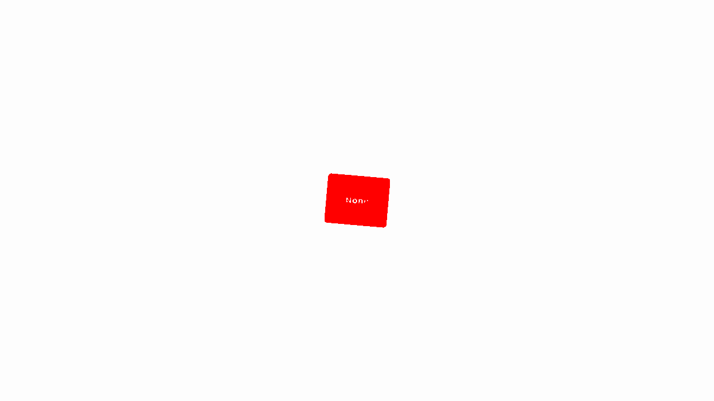

# Integration Testing Plugins

When building a component library, ensuring components remain accessible, semantically valid, and visually consistent over time is critical.

Django Design System provides an optional, plugin-based testing engine that automatically loops through **every variant** and **every theme** of your components (or a filtered subset) to run assessments.

Out of the box, we provide plugins for:
- **Accessibility**: Automatically run Axe-core against every state of every component to catch WCAG violations early.
- **HTML Validation**: Strictly parse the rendered component HTML to ensure there are no orphaned or unclosed tags that could break a consumer's page layout.
- **Visual Regression**: Compare components pixel-by-pixel against known baselines using pixelmatch, generating diff images automatically when styles diverge.

## 1. How Optional Dependencies Work

If you only want to use the design system to render components, you simply install the core package:
```bash
pip install dj-design-system
```
This installs only the core requirements (like Django). It does *not* install heavy testing libraries like Playwright, pixelmatch, or Axe-core.

If you want to write tests using our assessment tools, you specify the relevant "extra" in your installation command. By breaking the testing tools into specific groups, you can opt-in *only* to the libraries you actually need.

*   **`testing-a11y`**: Installs Playwright and `axe-playwright-python` for accessibility testing.
*   **`testing-visual`**: Installs Playwright, `Pillow`, and `pixelmatch` for visual regression testing.
*   **`testing-playwright`**: Installs only Playwright (useful for HTML validation).
*   **`testing-all`**: Installs everything.

### What if I forget the dependency?
Because our plugins use **lazy imports**, your test suite won't immediately crash if you haven't installed the extras. Instead, when you instantiate or run a plugin, it catches the `ImportError` and raises a friendly, actionable error instructing you on exactly what to install (e.g. `pip install "dj-design-system[testing-a11y]"`).

---

## 2. Walkthrough: Testing a Component

Let's walk through testing your components using Pytest.

### Step 1: Installation
First, install the package with the specific extra you need (e.g., accessibility):
```bash
pip install "dj-design-system[testing-a11y]"
playwright install --with-deps
```

### Step 2: Writing the Test
In your Django app, write a standard Pytest test using `pytest-playwright` and our `IterationEngine`:

```python
# my_app/tests/test_components.py
from dj_design_system import component_registry
from dj_design_system.testing.engine import IterationEngine
from dj_design_system.testing.plugins import AccessibilityPlugin

def test_component_accessibility(page, live_server):
    # 1. Instantiate the Axe accessibility plugin
    a11y_plugin = AccessibilityPlugin(page=page, base_url=live_server.url)

    # 2. Feed it into our IterationEngine with all your components
    engine = IterationEngine(components=component_registry.list_all())

    # 3. Run the plugins against the engine
    engine.run_plugins([a11y_plugin])
```

### Step 3: Filtering Components
If your suite is large, or you only want to test specific components, you can use the engine's filtering capabilities. Filters are functions that take `(component, variant, theme)` and return a boolean.

```python
engine = IterationEngine(components=component_registry.list_all())

# Only test components in the 'core' app
engine.add_filter(lambda comp, variant, theme: comp.app_label == "core")

# Exclude 'maximal' variants from testing
engine.add_filter(lambda comp, variant, theme: variant != "maximal")

engine.run_plugins([a11y_plugin])
```

### Step 4: Running the Test
Run `pytest`.
- The `IterationEngine` automatically loops through every valid component combination.
- The `AccessibilityPlugin` renders the component in isolation and runs Axe-core against the HTML.
- If you have missing `aria-labels` or poor color contrast, the test fails, and you get detailed Axe-core output indicating exactly which component variant failed.

---

## 3. Available Assessment Plugins

### AccessibilityPlugin
Uses [Axe-core](https://github.com/dequelabs/axe-core) to ensure your components meet WCAG accessibility standards.

```python
from dj_design_system.testing.plugins import AccessibilityPlugin

plugin = AccessibilityPlugin(
    page=page, 
    base_url=base_url,
    # You can disable specific axe rules (e.g., page-level rules for isolated components)
    disabled_rules=["landmark-one-main", "page-has-heading-one", "region"]
)
```

#### Example Accessibility Failure
When Axe-core detects a violation (such as poor color contrast), the test fails with detailed diagnostics:

```text
[badge | basic | dark | AccessibilityPlugin]: Accessibility violations found:
Found 1 accessibility violations:
Rule Violated:
color-contrast - Ensure the contrast between foreground and background colors meets WCAG 2 AA minimum contrast ratio thresholds
    Impact Level: serious
    Elements Affected:

    1)      Target: span
            Snippet: <span class="badge ">None</span>
            Messages:
            * Element has insufficient color contrast of 2.1 (foreground color: #ffffff, background color: #89b4fa). Expected contrast ratio of 4.5:1
```

### HTMLValidationPlugin
Performs strict parsing of the rendered HTML to ensure there are no orphaned or mismatched tags. This is critical for preventing malformed components from breaking larger page layouts.

```python
from dj_design_system.testing.plugins import HTMLValidationPlugin

plugin = HTMLValidationPlugin(page=page, base_url=base_url)
```

#### Example HTML Validation Failure
If a component emits invalid HTML (such as closing a self-closing tag incorrectly), the strict parser will catch it:

```text
[divider | basic | light | HTMLValidationPlugin]: HTML validation failed:
Mismatched closing tag: expected </div>, got </hr>
Orphaned closing tag: </div>
Orphaned closing tag: </body>
Orphaned closing tag: </html>
```

### VisualRegressionPlugin
Uses [Pixelmatch](https://github.com/mapbox/pixelmatch) to compare the component against a known baseline snapshot. If the component looks different, the test fails.

```python
from dj_design_system.testing.plugins import VisualRegressionPlugin

plugin = VisualRegressionPlugin(
    page=page,
    base_url=base_url,
    # Set to True to overwrite existing baselines
    update_snapshots=False,
    # Set to True to generate a visual diff image on failure
    enable_diff=True,
    threshold=0.1,
    baseline_dir="tests/snapshots/baseline",
    actual_dir="tests/snapshots/actual",
    diff_dir="tests/snapshots/diff",
)
```

#### Example Visual Regression Failure
When a component changes visually, the plugin can generate a diff image highlighting exactly what changed:



---

## 4. Writing Custom Plugins

The architecture is highly extensible. If you want to assert something specific—such as SEO metadata, custom data attributes, or framework-specific conventions—you can easily write your own plugin by subclassing `AssessmentPlugin`.

```python
from dj_design_system.testing.engine import AssessmentPlugin
import urllib.parse

class MyCustomPlugin(AssessmentPlugin):
    def __init__(self, page, base_url):
        self.page = page
        self.base_url = base_url

    def run_assessment(self, component, variant, theme):
        # 1. Construct the URL for the isolated component preview
        params = {"component": component.qualified_name, "theme": theme}
        # (You would normally inject kwargs based on the variant here)

        url = f"{self.base_url}/_canvas/?{urllib.parse.urlencode(params)}"
        self.page.goto(url)

        # 2. Assert your custom logic
        if not self.page.locator(".my-required-class").is_visible():
            # 3. Raise an AssertionError if your check fails
            raise AssertionError(f"{component.name} is missing .my-required-class!")
```
